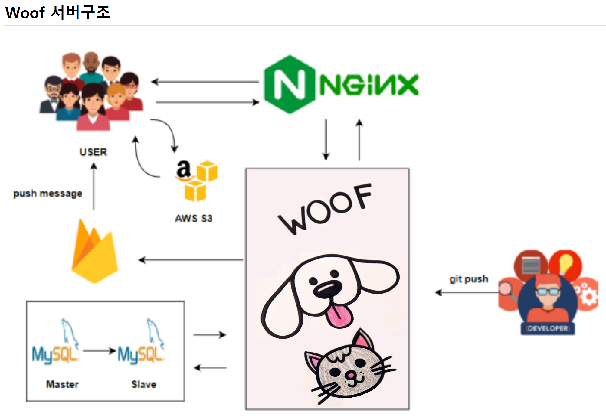

<h1 align="center">주제 👍</h1>


<div align="center">
  
</div>


> [플레이 데이터] 한화시스템 BEYOND SW캠프 / Woof


🎬[Demo 시연영상](https://www.youtube.com/watch?v=dhMrKTwNI8U&lc=UgzCJR3WxkvsckRyyO94AaABAg&ab_channel=%EB%94%B0%EB%9D%BC%ED%95%98%EB%A9%B4%EC%84%9C%EB%B0%B0%EC%9A%B0%EB%8A%94IT)   
📃[프로젝트 회고록](블로그주소) 

<br>

## ✨ 프로젝트 설명

```sh
반려동물 시장과 1인 가구의 규모가 점점 커지면서 반려동물 서비스가 많아지고 있다.
하지만 1인 가구에서 시간을 내어 이동하고 맡기고 데리고 오고 하는 것은 제약이 크다.
Woof는 사용자 주변 반려동물 업체의 정보를 제공하고 예약 및 1:1 픽업 서비스를 제공하고자 한다.
```

## 📌 프로젝트 목표

```sh
어떤 어떤 기술을 활용해 어떤 걸 구현하려 했다.
```

## 프로젝트 설계



## 🔍 요구사항 명세서

<details>
<summary>자세히 보기(클릭)</summary>

<!-- 일단 옛날꺼 복붙한거임 -->
[1] 사용자

1. Woof에 회원가입을 할 수 있다
   ->ID, PW, e-mail을 입력해야 한다
2. 로그인을 할 수 있다
3. 아이디는 이메일로 비밀번호는 대문자, 소문자, 특수문자를 사용하여 10자리 이상으로 설정한다
4. 원하는 시간대에 예약을 할 수 있다
   ->1시간 단위로 예약이 가능하고 중복 선택이 가능하다
5. 각 서비스 마다 요구사항을 작성할 수 있다

[2] 업체(유치원, 병원, 미용실)
1. 업체 등록을 할 수 있다
   ->ID, PW, e-mail, 사업자등록증을 입력해야한다
2. 예약한 고객 정보를 확인하고 관리할 수 있다.

[3] Woof 매니저
1. 우프는 매니저의 경력, 차량 번호, 사원번호를 등록할 수 있다
2. 사용자는 반려동물의 상태에 따라 매니저의 성별을 선택할 수 있고 미선택시 랜덤배정이 된다
3. 고객의 정보를 확인하고 매니저를 배정한다

[4] 예약
1. 고객은 시간, 픽업장소를 선택할 수 있다
2. 고객은 가게 책임자의 ID를 확인할 수 있다
3.  사용자들은 예약번호와 시간, 매니저의 식별번호를 확인할 수 있다
4. 예약 내역은 예약 시간, 처치내용, 방문업체를 사용자로부터 수집한다.

[5] 리뷰
1. 사용자는 이용한 업체에 대한 리뷰 작성과 사진 첨부가 가능하다
2. 사용자는 리뷰 열람에 대한 권한 설정을 할 수 있다.
3. 업체는 고객의 리뷰 번호와 별점, 사진을 확인할 수 있다
4. 업체는 고객의 리뷰에 댓글을 작성할 수 있다
5. 리뷰 작성 시 최소 10글자 이상, 사진 선택, 별점 필수
6. 별점이 일정 시간 이상 꾸준히 낮다면 업체는 상위 노출이 되지 않게 패널티를 부여 받는다


[6] 결제
1. woof는 사용자에게 결제를 요청할 수 있다

[7] 반려동물 등록
1. 고객은 반려동물의 상태를 등록할 수 있다
2. 고객은 반려동물의 나이, 보유질환, 반려동물 등록번호를
3. 업체는 고객의 반려동물의 정보를 확인할 수 있다.
</details>


## 기능 명세서
swagger-ui


## 테스트 및 결과

<details>
<summary>회원 정보 조회</summary>
<div>
<figure align="center"> 
  
    <p>~~~ 조회</p>
 </figure>
</div>
</details>


## 🤼‍♂️팀원

Team Leader : 🐯**홍길동**

Backend : 🐶 **김철수**

Backend : 🐺 **박철수**

Frontend : 🐱 **이철수**

인공지능 : 🦁 **최철수**
